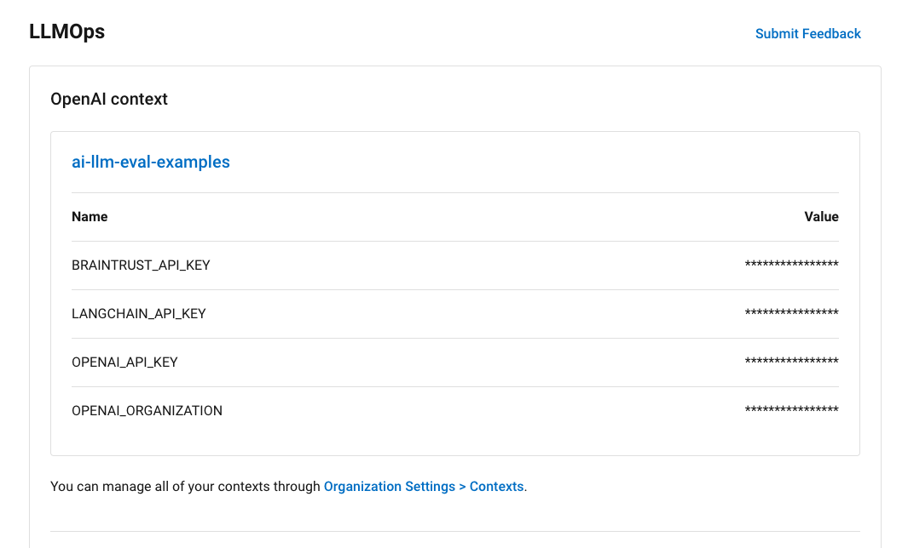

# LLM Eval Examples

A collection of LLM eval examples using the [CircleCI Evals Orb](https://circleci.com/developer/orbs/orb/circleci/evals).

## Prerequisites

Before running any of the examples, you'll need:

- A **CircleCI account** connected to your code. You can [sign up for free](https://circleci.com/signup/).
- An **OpenAI account**. Sign up for an OpenAI account at [openai.com](https://openai.com) to access their platform and API. Once logged into your OpenAI account, generate your API key. Make note of the `API Key` and `Organization ID`.

Depending on your choice of evaluation provider, you will also need one of the following:

- A **Braintrust account**. Sign up for a Braintrust account at [braintrustdata.com](https://www.braintrustdata.com) to access their platform and API. Once logged into your Braintrust account, generate an `API Key` and make note of it.
- A **LangSmith account**. Sign up for a LangSmith account at [langsmith.com](https://langsmith.com) to use their language models API. Once logged into your LangSmith account, go to the API Keys page in your account settings to generate an API key. Copy this key to authenticate when using the LangSmith API.

The API keys will allow you to authenticate and interact with the APIs of your LLMOps tools to leverage their services.

See their documentation for more details on capabilities and usage.

### Entering credentials into CircleCI

Entering your OpenAI, Braintrust, and LangSmith credentials into CircleCI is easy.

Just navigate to `Project Settings` > `LLMOps` and fill out the form by Clicking `Set up Integration`.


This will create a context with environment variables with the credentials you've set up above. Make a note of the generated context name.



## The CircleCI Evals Orb

The [CircleCI Evals Orb](https://circleci.com/developer/orbs/orb/circleci/evals) simplifies the definition and execution of evaluation jobs using popular third-party tools, and generates reports of evaluation results.

Given the volatile nature of evaluations, evaluations orchestrated by the [evals orb](https://circleci.com/developer/orbs/orb/circleci/evals) do not halt the pipeline if an evaluation fails. This approach ensures that the inherent flakiness of evaluations does not disrupt the development cycle.

Instead, a summary of the evaluation results can _optionally_ be presented:

- as a comment on the corresponding GitHub pull request
- as an artifact within the CircleCI User Interface

### Orb Parameters

The [evals orb](https://circleci.com/developer/orbs/orb/circleci/evals) accepts the following parameters:

_Some of the parameters are optional based on the eval platform being used._

##### Common parameters

- `circle_pipeline_id` - CircleCI Pipeline ID

- `cmd` - Command to run the evaluation

- `eval_platform` - Evaluation platform (e.g. `braintrust`, `langsmith` etc. - default: `braintrust`)

- `evals_result_location` - Location to save evaluation results (default: `./results`)

##### Braintrust-specific parameters

- `braintrust_experiment_name` (optional) - Braintrust experiment name. We will generate a unique name based on an MD5 hash of "`<CIRCLE_PIPELINE_ID>_<CIRCLE_WORKFLOW_ID>`" if no `braintrust_experiment_name` is provided.

##### LangSmith-specific parameters

- `langsmith_endpoint` - (optional) LangSmith API endpoint (default: `https://api.smith.langchain.com`)

- `langsmith_experiment_name` (optional) - LangSmith experiment name. We will generate a unique name based on an MD5 hash of "`<CIRCLE_PIPELINE_ID>_<CIRCLE_WORKFLOW_ID>`" if no `langsmith_experiment_name` is provided.

## Getting started

Fork this repo to run evaluations on a LLM-based application using the [evals orb](https://circleci.com/developer/orbs/orb/circleci/evals).
This repository includes evaluations that can be run on two evaluation platforms: [Braintrust](https://www.braintrustdata.com/) and [LangSmith](https://smith.langchain.com/). Each example folder contains instructions and sample code to run evaluations.

### The Braintrust Example

The Braintrust example imports from HuggingFace an evaluation dataset of news articles, and uses ChatGPT to help classify them into category. The dataset contains both the news article and the expected category for each of them. As an evaluation metric, we use the Levenshtein distance, which tells us how distant the answer provided by ChatGPT is from the expected answer. Each individual test case is scored, and a summary score for the whole dataset is also available.


### The LangSmith Example

In the LangSmith example, we instantiate the dataset ourselves. Ahead of triggering your evaluation via CircleCI, run the following commands:

```
cd ./experiments/ai-langsmith
pip install -r ./requirements.txt
python dataset.py
```

The dataset contains a list of topics which we want ChatGPT to write poems about. It also contains, for each topic, a letter or word which should not be included in the poem. In our evaluation, we use the LangSmith `ConstraintEvaluator` to verify whether our LLM has accurately avoided using the letter or word. By accessing the LangSmith platform we are able to access all scores by test case.

### The Results

In both cases, as evaluations are run through the [evals orb](https://circleci.com/developer/orbs/orb/circleci/evals), CircleCI stores the summary of eval results as a job artifact.


If a `GITHUB_TOKEN` has been set up, the orb will also post summarized eval results as a PR comment:


### Config

The `.circleci/run_evals_config.yml` file uses the [evals orb](https://circleci.com/developer/orbs/orb/circleci/evals) to define jobs that run the evaluation code in each example folder. The orb handles setting up the evaluation environment, executing the evaluations, and collecting the results.

For example, the Braintrust job runs the Python script in `braintrust/eval_tutorial.py` by passing it as the `cmd` parameter. It saves the evaluation results to the location specified with `evals_result_location`.

Similarly, the LangSmith job runs the Python script in `langsmith/eval.py`.

To change where the results of the evaluation are being saved, go to the `evals/eval` step, and add the parameter `evals_result_location`:

_Note: the [evals orb](https://circleci.com/developer/orbs/orb/circleci/evals) will make the directory if it does not exist._

```yaml
- evals/eval:
    circle_pipeline_id: << pipeline.id >>
    eval_platform: ...
    evals_result_location: "./my-results-here"
    cmd: ...
```

To enable the orb to post a summary of the evaluation results as a PR comment:

- Generate a [Github Personal Access Token](https://circleci.atlassian.net/wiki/spaces/PES/pages/7172948051/Display+Webhooks+Received) with `repo` scope.
- Add this token as the environment variable `GITHUB_TOKEN` in CircleCI project settings. Alternatively, you can also include this secret in the context created when you setup the LLMOps integration.

The examples included in this repository use [dynamic configuration](https://circleci.com/docs/dynamic-config/) to selectively run only the evaluations defined in the folder that changed. So, for changes committed to the folder `braintrust`, only your Braintrust evaluations will be run; for changes committed to the folder `langsmith`, only your LangSmith evaluations will be run.

```shell
.
├── README.md
├── braintrust
│   ├── eval_tutorial.py
│   ├── README.md
│   └── requirements.txt
└── langsmith
    ├── dataset.py
    ├── eval.py
    ├── README.md
    └── requirements.txt
```

## Happy Evaluating!

Let us know if you have any feedback trying these out.

Submit an [issue](https://github.com/CircleCI-Public/llm-eval-examples/issues) on GitHub, or reach out to us at [ai-feedback@circleci.com](mailto:ai-feedback@circleci.com).
